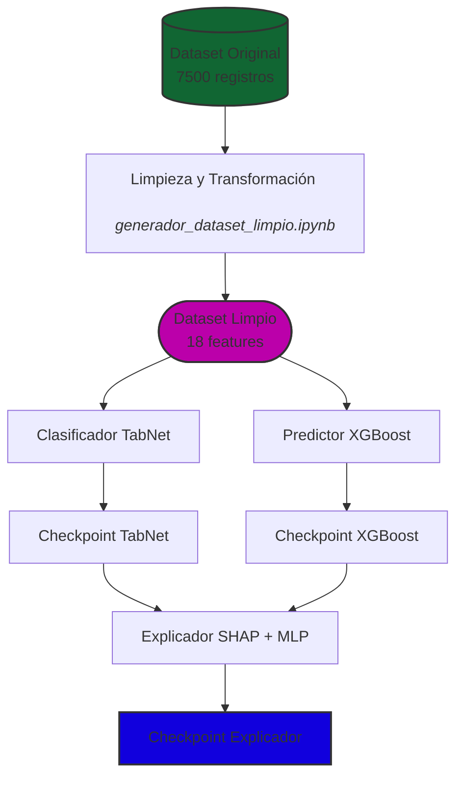
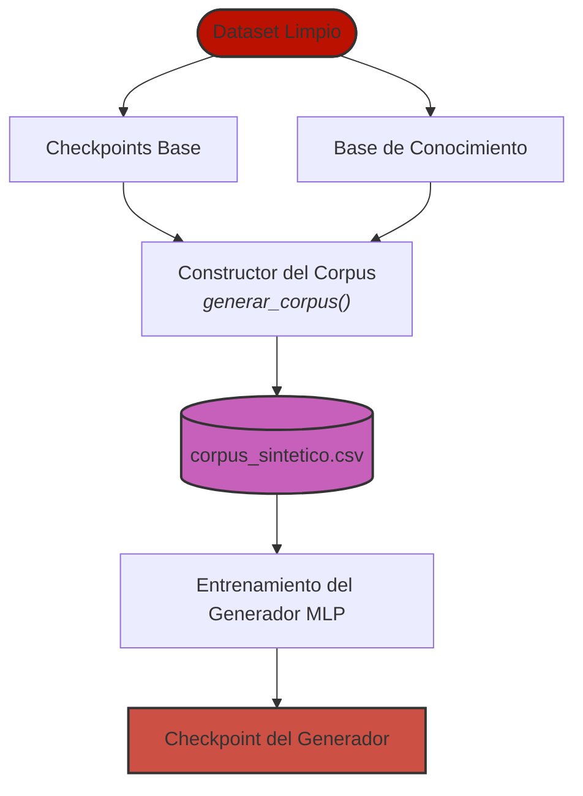
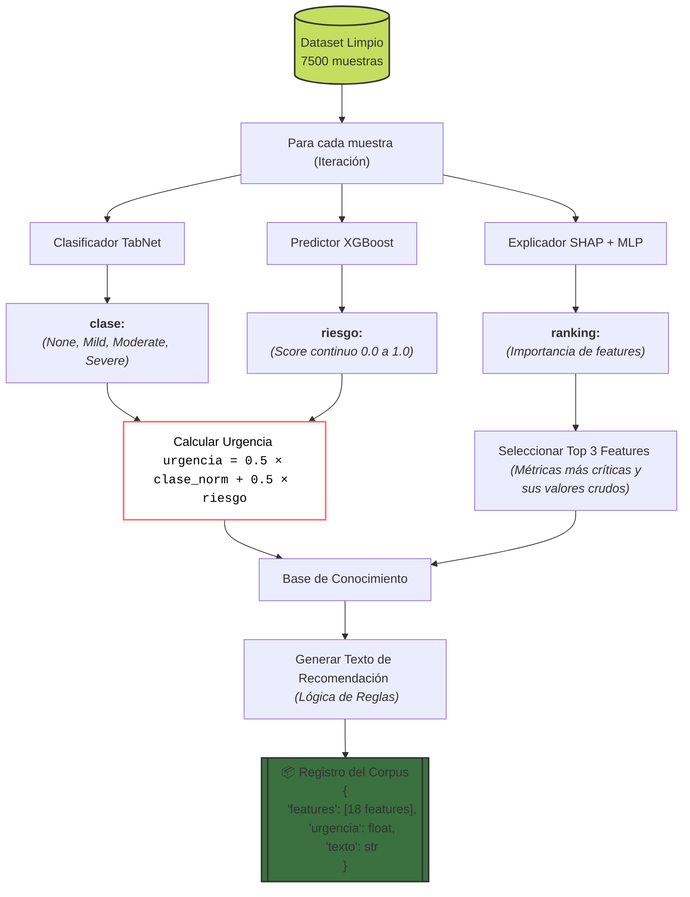
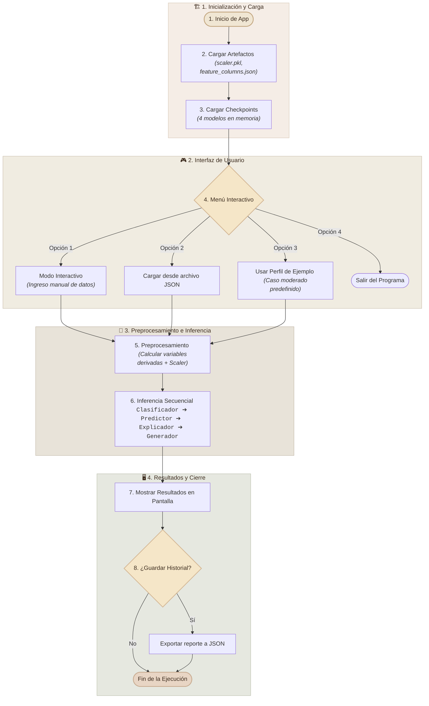
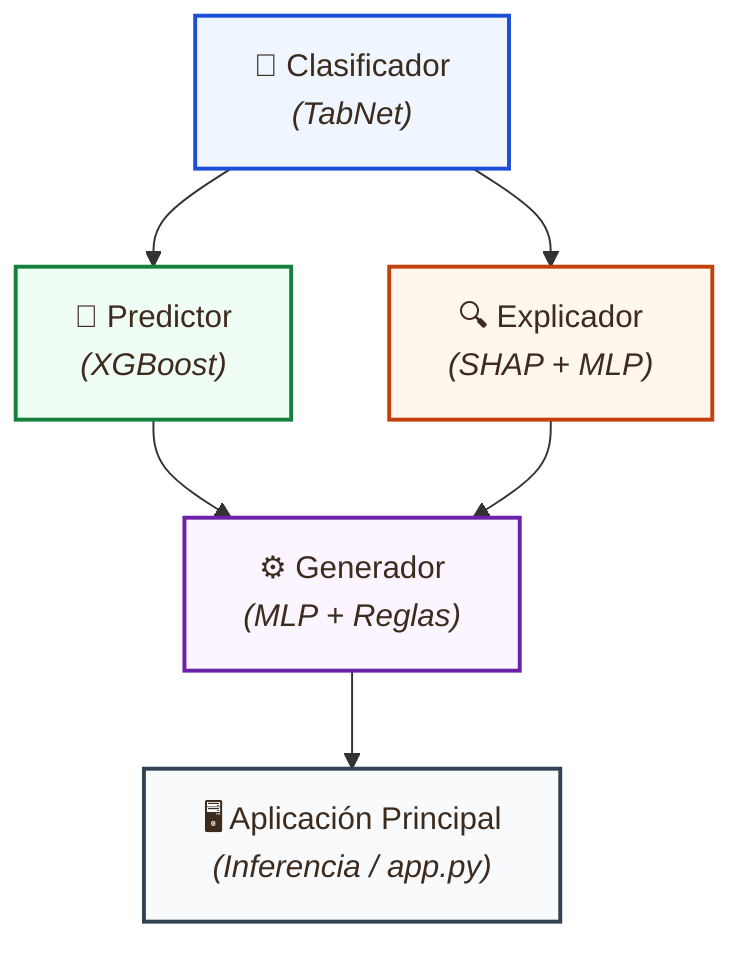
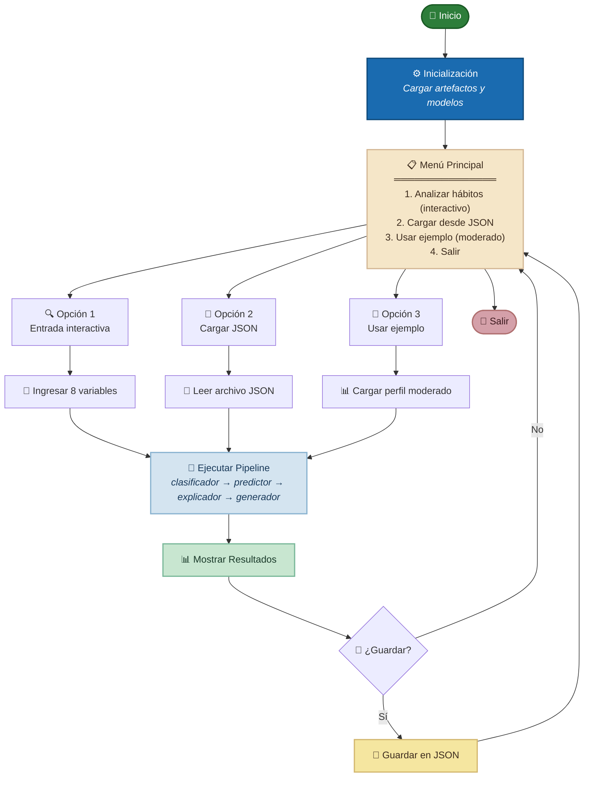

# 📡 Radar Digital

Sistema Inteligente Multimodelo para el Análisis, Predicción, Explicación y Generación de Recomendaciones sobre Hábitos Digitales mediante Aprendizaje Profundo

## ¿Qué es?

Radar Digital es un sistema inteligente capaz de analizar con precisión tu comportamiento digital a partir del uso de tu teléfono móvil. A través del monitoreo de hábitos como el tiempo de pantalla, horas de sueño, uso de redes sociales y notificaciones, el sistema puede:

- Clasificar tu nivel de adicción digital (None, Mild, Moderate, Severe)
- Predecir el riesgo futuro de empeorar tus hábitos
- Explicar qué factores están influyendo en tu comportamiento
- Generar recomendaciones personalizadas para mejorar tu relación con la tecnología

Todo esto mediante un pipeline de modelos de inteligencia artificial que trabajan en conjunto para ofrecerte un análisis completo y accionable.

##  Estructura del Proyecto

```text
Proyecto_Habitos_Digitales/
│
├── 📄 app.py                        # Aplicación principal (integrador de modelos)
├── 📄 utils.py                      # Utilidades compartidas (carga, guardado, preprocesamiento)
├── 📋 requirements.txt              # Dependencias del proyecto
├── 📄 README.md                     # Documentación completa del proyecto
│
├── 📂 checkpoints/                  # Modelos entrenados y sus metadatos
│   ├── 📂 clasificador/             # Checkpoint del clasificador TabNet
│   │   ├── 🤐 modelo_tabnet.zip     # Modelo TabNet comprimido
│   │   ├── 💾 metadata.pkl          # Metadatos (clases, features, configuración)
│   │   ├── 📊 historial_tabnet.csv  # Historial de entrenamiento (loss, accuracy)
│   │   ├── 🖼️ confusion_matrix_tabnet.png  # Matriz de confusión
│   │   ├── 🖼️ historial_entrenamiento.png  # Gráfica de entrenamiento
│   │   └── 🖼️ historial_entrenamiento_mejorado.png  # Gráfica mejorada
│   │
│   ├── 📂 predictor/                # Checkpoint del predictor XGBoost
│   │   ├── ⚙️ modelo_xgboost.json   # Modelo XGBoost en formato JSON
│   │   ├── 💾 metadata.pkl          # Metadatos (features, configuración)
│   │   ├── 📊 historial_xgboost.csv # Historial de entrenamiento (RMSE)
│   │   ├── 🖼️ evaluacion_xgboost.png # Gráfica de evaluación
│   │   ├── 🖼️ historial_xgboost.png # Gráfica de entrenamiento
│   │   ├── 🖼️ historial_entrenamiento.png  # Gráfica de entrenamiento
│   │   └── 📊 historial_entrenamiento.csv  # Historial de entrenamiento
│   │
│   ├── 📂 explicador/               # Checkpoint del explicador MLP
│   │   ├── 🧠 modelo_explicador.pth # Modelo MLP en formato PyTorch
│   │   ├── 📊 historial_explicador.csv  # Historial de entrenamiento
│   │   ├── 🖼️ historial_explicador.png  # Gráfica de entrenamiento
│   │   ├── 🖼️ shap_importancias.png     # Importancias SHAP globales
│   │   ├── 🖼️ evaluacion_explicador.png # Gráfica de evaluación
│   │   └── 🖼️ importancias_ejemplo.png  # Ejemplo de importancias
│   │
│   └── 📂 generador/                # Checkpoint del generador MLP + Reglas
│       ├── 🧠 modelo_generador.pth  # Modelo MLP en formato PyTorch
│       ├── 📊 corpus_sintetico.csv  # Dataset sintético para entrenamiento
│       ├── 📊 historial_generador.csv   # Historial de entrenamiento
│       ├── 🖼️ historial_generador.png   # Gráfica de entrenamiento
│       ├── 🖼️ evaluacion_generador.png  # Gráfica de evaluación
│       └── 🖼️ historial_entrenamiento.png  # Gráfica de entrenamiento
│
├── 📂 datasets/                     # Datos utilizados en el proyecto
│   ├── 📊 Smartphone_Usage_And_Addiction_Analysis_7500_Rows.csv  # Dataset original
│   ├── 📂 limpio_procesado/
│   │   └── 📊 dataset_limpio.csv    # Dataset limpio y normalizado
│   └── 📂 artifacts/                # Artefactos para consistencia y transformación
│       ├── 💾 scaler.pkl            # StandardScaler para normalización
│       ├── 💾 label_encoder.pkl     # Codificador de clases (None→0, Mild→1, etc.)
│       ├── ⚙️ feature_columns.json  # Metadatos de features (18 columnas)
│       ├── ⚙️ dataset_statistics.json # Estadísticas del dataset
│       ├── 🖼️ class_distribution.png   # Distribución de clases
│       ├── 🖼️ correlation_matrix.png   # Matriz de correlación
│       ├── 🖼️ boxplots_by_class.png    # Boxplots por clase
│       ├── 🖼️ feature_distributions_by_class.png  # Distribuciones por clase
│       └── 💾 feature_names.pkl     # Nombres de features (respaldo)
│
├── 📂 models/                       # Scripts con la arquitectura de los modelos
│   ├── 🐍 clasificador.py           # Clasificador TabNet
│   ├── 🐍 predictor.py              # Predictor XGBoost
│   ├── 🐍 explicador.py             # Explicador SHAP + MLP
│   └── 🐍 generador.py              # Generador MLP + Reglas
│
├── 📂 notebooks/                    # Jupyter Notebooks de desarrollo
│   ├── 📓 generador_dataset_limpio.ipynb  # Limpieza y preparación del dataset
│   ├── 📓 train.ipynb               # Entrenamiento centralizado
│   └── 📓 evaluate.ipynb            # Evaluación de modelos
│
└── 📂 resultados_evaluaciones/      # Resultados de las evaluaciones
    ├── 🖼️ evaluacion_clasificador.png  # Matriz de confusión del clasificador
    ├── 🖼️ evaluacion_predictor.png     # Gráfica de predicciones vs reales
    ├── 🖼️ evaluacion_generador.png     # Gráfica de predicciones del generador
    ├── 📊 resultados_entrenamiento.csv  # Resumen de entrenamiento
    ├── ⚙️ resultados_entrenamiento.json # Resumen de entrenamiento (JSON)
    └── ⚙️ resultados_evaluacion.json    # Resumen de evaluaciones (JSON)

```

## Dataset

Digital Habits & Smartphone Addiction Dataset
(https://www.kaggle.com/datasets/guriya79/smart-phone/data)

### Descripción

El dataset contiene información sobre hábitos digitales de 7,500 usuarios, incluyendo métricas como tiempo de pantalla, uso de redes sociales, horas de sueño, notificaciones y nivel de adicción (None, Mild, Moderate, Severe).

### Limpieza del Dataset

     Variables Observables Automáticamente

Variables que pueden ser obtenidas directamente por un dispositivo móvil:

| Variable | ¿Automatizable? | Estado / Nota |
| :--- | :---: | :--- |
| `daily_screen_time_hours` | ✅ | Sí |
| `social_media_hours` | ✅ | Sí |
| `gaming_hours` | ✅ | Sí |
| `work_study_hours` | ✅ | Sí |
| `sleep_hours` | ⚠️ | Inferible / Estimado |
| `notifications_per_day` | ✅ | Sí |
| `app_opens_per_day` | ✅ | Sí |
| `weekend_screen_time` | ✅ | Sí |
     
     Variables Derivadas

No existen en el dataset original; se calculan durante el preprocesamiento:

| Variable Derivada | Fórmula Matemática / Lógica | Descripción |
| :--- | :--- | :--- |
| `screen_time_weekend_difference` | `weekend_screen_time` - `daily_screen_time_hours` | Diferencia de uso entre fin de semana y días de semana. |
| `social_media_ratio` | `social_media_hours` / (`daily_screen_time_hours` + 0.01) | Proporción del tiempo total dedicada a redes sociales. |
| `gaming_ratio` | `gaming_hours` / (`daily_screen_time_hours` + 0.01) | Proporción del tiempo total dedicada a videojuegos. |
| `work_study_ratio` | `work_study_hours` / (`daily_screen_time_hours` + 0.01) | Proporción del tiempo total dedicada a productividad/estudio. |
| `usage_intensity_index` | (`notifications_per_day` + `app_opens_per_day`) / 100 | Índice general de interactividad y micro-uso con el teléfono. |
| `productivity_ratio` | `work_study_hours` / (`social_media_hours` + `gaming_hours` + 0.01) | Balance entre tiempo productivo y tiempo de ocio. |
| `notification_intensity` | `notifications_per_day` / (`daily_screen_time_hours` + 0.01) | Frecuencia de notificaciones recibidas por hora de pantalla. |
| `total_usage_composite` | (`screen_time` × 0.3) + (`social_media` × 0.25) + (`gaming` × 0.15) + (`work_study` × 0.1) + ((`notifications` / 100) × 0.2) | Score ponderado del impacto del uso general del dispositivo. |
| `sleep_screen_imbalance` | `daily_screen_time_hours` / (`sleep_hours` + 0.01) | Relación entre las horas despierto frente a la pantalla vs. horas de sueño. |
| `entertainment_dominance` | (`social_media_hours` + `gaming_hours`) / (`work_study_hours` + 0.01) | Qué tanto domina el entretenimiento sobre las obligaciones. |
| `digital_compulsivity` | `app_opens_per_day` / (`daily_screen_time_hours` + 0.01) | Frecuencia de desbloqueos/aperturas por cada hora de uso. |

     Variables Descartadas

Son las variables que no usaremos porque para el analisis de datos, esta clase de variables no influyen en nuestro sistema inteligente

- transaction_id (identificador único)
- user_id (identificador único)
- stress_level (no observable automáticamente)
- academic_work_impact (no observable automáticamente)
- addicted_label (binario redundante con addiction_level)


### Total de features finales: 18

## Flujo del Proyecto

En esta seccion se describira como el sistema inteligente se desarrolla mediante diferentes etapas.

### 📌 Etapa 1: Preparación y Entrenamiento de Modelos Base



### 📌 Etapa 2: Construcción del Corpus del Generador



### 📌 Etapa 3: Sistema Inteligente (Inferencia)

```mermaid
graph TD
    User([ Usuario]) --> Prep["Preprocesamiento <br> <i>utils + scaler</i>"]
    
    subgraph EstadoCompartido [📦 ESTADO COMPARTIDO]
        direction TB
        DU["<b>datos_usuario:</b><br>{screen_time, ...}"]
        CL["<b>clasificacion:</b><br>{clase, confianza}"]
        PR["<b>prediccion:</b><br>{riesgo, categoria}"]
        EX["<b>explicacion:</b><br>{ranking}"]
        RE["<b>recomendacion:</b><br>{texto, prioridad}"]
    end

    Prep --> EstadoCompartido
    EstadoCompartido --> End([ Respuesta Final])

    style User fill:#20a,stroke:#333,stroke-width:2px
    style EstadoCompartido fill:#b10b10b10,stroke:#666,stroke-width:1px
    style End fill:#141,stroke:#333,stroke-width:2px
```



## Modelos del sistema

     Clasificador (TabNet)

Archivo: models/clasificador.py

Arquitectura: TabNet con atención sparsemax

#### ¿Por qué TabNet?

- Interpretabilidad nativa: La atención sparsemax permite identificar qué características usa el modelo en cada paso

- Selección automática de features: Reduce el sobreajuste al aprender qué variables son relevantes

- Regularización incorporada: Parámetros como lambda_sparse y gamma controlan la complejidad

#### Entrada: 18 features normalizadas (comportamiento digital)

#### Salida: 
- Clase de adicción (None, Mild, Moderate, Severe)
- Probabilidades por clase
- Confianza de la predicción

#### Checkpoint: checkpoints/clasificador/modelo_tabnet.zip

#### Metrica:

accuracy: 0.5253
precision: 0.5274
recall: 0.5253
f1: 0.4983

     Predictor (XGBoost)

Archivo: models/predictor.py

Arquitectura: XGBoost Regressor

#### ¿Por qué XGBoost?

- Rendimiento superior: Excelente para regresión en datos tabulares

- Interpretabilidad: Importancia de features nativa (gain, weight, cover)

- Robustez: Maneja bien outliers y datos desbalanceados

#### Entrada: 18 features normalizadas

#### Salida:

- Riesgo compuesto (0-1): probabilidad de empeorar hábitos

- Categoría de riesgo (Bajo, Medio, Alto)

#### Checkpoint: checkpoints/predictor/modelo_xgboost.json

#### Top 5 características importantes:

1. sleep_screen_imbalance (43.28%)
2. social_media_hours (17.17%)
3. total_usage_composite (13.58%)
4. sleep_hours (7.79%)
5. social_media_ratio (4.57%)

#### Metrica:

mse: 0.0001
rmse: 0.0097
mae: 0.0076
r2: 0.9953


     Explicador (SHAP + MLP)

Archivo: models/explicador.py

Arquitectura: Híbrido SHAP + MLP (aproximación)

#### ¿Por qué este enfoque?

- SHAP es lento en producción: Calcular SHAP para cada predicción tomaría ~2-5 segundos

- MLP aproximador: Una vez entrenado, predice importancias en <10ms (200x más rápido)

- Mantiene la interpretabilidad: Aproxima las importancias de SHAP con alta precisión

#### Proceso de entrenamiento:

1. Generación de etiquetas SHAP:

     1. Entrenar Random Forest en 2000 muestras
     2. Calcular SHAP values (importancias "reales")
     3. Normalizar por muestra (suma = 1)

2. Entrenamiento del MLP:

     1. Entrada: 18 features
     2. Salida: 18 importancias (una por feature)
     3. Arquitectura: [128, 64, 32] con dropout=0.2
     4. Pérdida: KLDivLoss (distribución de probabilidades)

#### Entrada: 18 features normalizadas

#### Salida: Ranking de features con sus importancias (ordenado descendentemente)

#### Checkpoint: checkpoints/explicador/modelo_explicador.pth

#### Métrica: 
mae: 0.0102
r2: 0.4389

     Generador (MLP + Reglas)

Archivo: models/generador.py

Arquitectura: Híbrido MLP + Base de Conocimiento

#### ¿Por qué este enfoque?

- Sin datos etiquetados: El dataset original no contiene recomendaciones

- Corpus sintético: Se genera automáticamente combinando los otros 3 modelos

- MLP para urgencia: Predice la urgencia de la situación (0-1)

- Reglas para texto: Base de conocimiento con recomendaciones redactadas por humanos

- Rápido y económico: Sin necesidad de LLM (latencia <100ms)

#### Generación del Corpus Sintético:



#### Base de Conocimiento:

- Variables: screen_time, social_media, sleep, night_usage, notifications

- Niveles: bajo, medio, alto

- 3-5 recomendaciones por variable/nivel

#### Entrada: 18 features normalizadas

#### Salida:

- Urgencia estimada (0-1)

- Texto de recomendación personalizado

- Prioridad (Bajo, Medio, Alto)

#### Checkpoint: checkpoints/generador/modelo_generador.pth

#### Métrica: 

mse: 0.0050
rmse: 0.0709
mae: 0.0548
r2: 0.9168

## Notebooks

     generador_dataset_limpio.ipynb

Ubicación: notebooks/generador_dataset_limpio.ipynb

Propósito: Limpieza y preparación del dataset

#### Proceso:

1. Carga del dataset original
2. Selección de variables relevantes
3. Limpieza de registros (valores nulos, duplicados)
4. Generación de variables derivadas (11 nuevas)
5. Conservación de copias sin escalar (_raw) para el predictor
6. Codificación de la variable objetivo (None→0, Mild→1, Moderate→2, Severe→3)
7. Normalización con StandardScaler
8. Eliminación de features redundantes (weekend_screen_time)
9. Guardado de dataset limpio y artefactos (scaler, label_encoder, feature_columns.json)

#### Artefactos generados:

- dataset_limpio.csv (7500 registros, 25 columnas)
- scaler.pkl (para consistencia en inferencia)
- label_encoder.pkl (codificación de clases)
- feature_columns.json (metadatos del dataset)
- dataset_statistics.json (estadísticas)

Estos artefactos seran usados por los diferentes modelos

     train.ipynb

Ubicación: notebooks/train.ipynb

Propósito: Centro de entrenamiento de modelos

#### Características:

- Selección de modelo a entrenar (MODELO_A_ENTRENAR)
- Opciones: "clasificador", "predictor", "explicador", "generador", "todos"
- Ejecuta el main() del modelo correspondiente
- Guarda resultados en resultados_entrenamiento.csv

#### Uso:

MODELO_A_ENTRENAR = "clasificador"  # O "predictor", "explicador", "generador", "todos"

#### Salida:

- Checkpoints actualizados

- Historiales de entrenamiento

- Gráficas de pérdida y métricas

Este notebook es esencial para ahorrar ciertos pasos para entrenar a los modelos

     evaluate.ipynb

Ubicación: notebooks/evaluate.ipynb

Propósito: Evaluación de modelos entrenados

#### Características:

- Selección de modelo a entrenar (MODELO_A_ENTRENAR)

- Opciones: "clasificador", "predictor", "explicador", "generador", "todos"

- Carga el checkpoint correspondiente

- Muestra métricas detalladas

#### Métricas por modelo:

| Modelo | Métricas de Desempeño y Artefactos |
| :--- | :--- |
| **Clasificador** | `Accuracy`, `Precision`, `Recall`, `F1-Score`, Matriz de Confusión, *Feature Importance* |
| **Predictor** | `MSE`, `RMSE`, `MAE`, `R²`, Gráficos de Error, *Feature Importance* |
| **Explicador** | `MAE`, `R²` |
| **Generador** | `MSE`, `RMSE`, `MAE`, `R²`, Gráficos de Error |

#### Salida:

- Tabla comparativa de métricas

- Gráficas de matrices de confusión, predicciones vs reales

- resultados_evaluacion.json

## 🧰 Utilidades y Aplicación

     utils.py

Ubicación: Raíz del proyecto

Propósito: Funciones compartidas (sin lógica de IA)

#### Funciones principales:

| Función | Propósito |
| :--- | :--- |
| `get_device()` | Detectar si hay GPU disponible (CUDA) o usar CPU por defecto. |
| `set_seed()` | Fijar la semilla global para garantizar la reproducibilidad de los experimentos. |
| `calcular_variables_derivadas()` | Aplicar las fórmulas de *Feature Engineering* para generar las 11 variables calculadas. |
| `cargar_artefactos()` | Cargar los objetos `scaler.pkl`, `label_encoder.pkl` y `feature_columns.json`. |
| `cargar_class_names()` | Cargar el mapeo de nombres de las clases desde el archivo JSON correspondiente. |
| `get_project_root()` | Obtener de forma dinámica la ruta absoluta de la raíz del proyecto. |
| `get_artifacts_path()` | Retornar la ruta correcta del directorio donde se alojan los artefactos. |
| `get_checkpoint_path()` | Retornar la ruta específica para guardar o cargar los pesos de un modelo. |

     app.py

Ubicación: Raíz del proyecto

Propósito: Integrador de todos los modelos (inferencia)

Funcionamiento:



#### Estado compartido: Cada modelo recibe y modifica su sección del estado, manteniendo desacoplamiento.

## Dependencias entre Modelos



## Orden de entrenamiento

| Script / Componente | Entregable / Output Principal |
| :--- | :--- |
| `generador_dataset_limpio.ipynb` | Dataset preparado y normalizado |
| `models/clasificador.py` | Checkpoint del Clasificador (TabNet) |
| `models/predictor.py` | Checkpoint del Predictor (XGBoost) |
| `models/explicador.py` | Checkpoint del Explicador (SHAP + MLP) |
| `models/generador.py` | Corpus Sintético + Checkpoint del Generador |
| `app.py` | Sistema Completo en producción |

## Como usarlo

## Requisitos del sistema

### Hardware recomendado

     - GPU: NVIDIA con 4GB+ VRAM (opcional, pero recomendado)
     - RAM: 8GB mínimo
     - Almacenamiento: 2GB disponible

### Dependencias principales

| Librería | Versión | Propósito |
|----------|---------|-----------|
| PyTorch | 2.0+ | Deep Learning (TabNet, MLP) |
| XGBoost | 2.0+ | Predictor |
| TabNet | 4.0+ | Clasificador |
| SHAP | 0.41+ | Explicador |
| scikit-learn | 1.2+ | Preprocesamiento, métricas |
| pandas | 2.0+ | Manipulación de datos |
| numpy | 1.24+ | Operaciones numéricas |

### Crear y activar entorno virtual

     # Crear entorno virtual
     python -m venv entorno_vir

     # Activar entorno virtual (Linux/Mac)
     source entorno_vir/bin/activate

     # Activar entorno virtual (Windows)
     entorno_vir\Scripts\activate

### Instalar dependencias

     pip install -r requirements.txt

### Preparar el dataset

     Ejecuta el notebook de limpieza para generar el dataset procesado y los artefactos:

```text
     jupyter notebook notebooks/generador_dataset_limpio.ipynb
```

Este notebook generará:

- datasets/limpio_procesado/dataset_limpio.csv
- datasets/artifacts/scaler.pkl
- datasets/artifacts/label_encoder.pkl
- datasets/artifacts/feature_columns.json

### Entrenar los modelos

     jupyter notebook notebooks/train.ipynb

- Opción A: Entrenar todos los modelos (recomendado)

     Cambia la variable MODELO_A_ENTRENAR a "todos" y ejecuta todas las celdas.

- Opción B: Entrenar un modelo específico

     MODELO_A_ENTRENAR = "clasificador"  # o "predictor", "explicador", "generador"

### Evaluar los modelos

     jupyter notebook notebooks/evaluate.ipynb

Cambia MODELO_A_EVALUAR según lo que quieras evaluar.

### Ejecutar la aplicación

     python app.py

